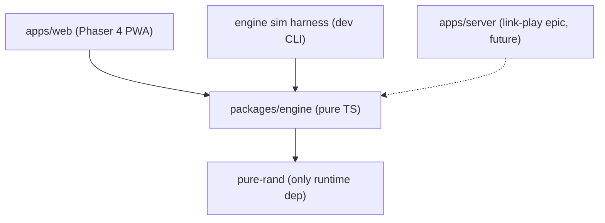
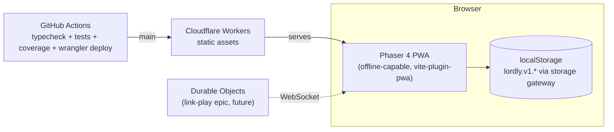

# Architecture Spine — Lord Battle Tactics

## Design Paradigm

**Functional core, imperative shell.**

- **Core** — `packages/engine`: immutable data in, pure functions, `BattleLog` out. No I/O, no clock, no `Math.random()`, no DOM, no Phaser, no Node APIs. All randomness flows from an injected seeded PRNG.
- **Shell** — `apps/*`: everything effectful — Phaser scenes, DOM, localStorage, network, time.

Every file answers one question: *core or shell?* A file that can't answer it is in the wrong place.

## Invariants & Rules

### AD-1 — Deterministic pure battle engine `[ADOPTED]`

- **Binds:** FR20, NFR2, NFR6; `packages/engine`
- **Prevents:** untestable combat; client/server result divergence in the link-play epic
- **Rule:** `resolveBattle(setup: MatchSetup): BattleLog` is a pure function — identical inputs give bit-identical output on any platform. All combat arithmetic is integer math (PRD FR15). The engine package imports nothing effectful; its only runtime dependency is `pure-rand`. Army sizing is data: a **slot budget** plus per-class slot costs live in the balance data (*amended 2026-07-16, Epic 4: budget 5, small = 1 slot, monster = 2 — FR1; through the MVP the budget was equivalent to "3 units"*) — never a hardcoded constant outside the balance data. **The slot vocabulary is canonical and exclusive:** `slotBudget` + per-class `slotCost` + an engine-exported `slotTotal(army)`; the shipped `armySize` constant is **deleted** at the FR1 story, and no code — engine validation, flow gates, or scene UI — may use `army.length` as a legality measure (a 3-unit two-monster army is full).

### AD-2 — Replay model: the engine resolves, the shell replays

- **Binds:** FR17–FR23, FR28; battle scene, result screen
- **Prevents:** gameplay rules leaking into the render loop; special-case code paths for skip / speed / replay / server verification
- **Rule:** the engine resolves the entire battle up front into an immutable, ordered `BattleLog`. `apps/web` never evaluates a combat rule — the battle scene is a pure player of the log (any speed, skippable, replayable from history). Anything **dynamic** the UI needs to show must be an event in the log (AD-12); **static per-unit facts** (class, element, name, monster footprint) come from `MatchSetup` via engine-exported helpers — the renderer may read the setup, never re-derive a rule.

### AD-3 — Dependency direction: everything depends on the engine, the engine depends on nothing

- **Binds:** all packages
- **Prevents:** Phaser types bleeding into the core; circular knots when `apps/server` arrives
- **Rule:** dependencies flow only as drawn. The engine never imports from `apps/*`. New workspaces point at the engine, never sideways at other apps.



### AD-4 — The engine owns the domain vocabulary and the balance data

- **Binds:** all types shared across packages; NFR4
- **Prevents:** two owners of the battle vocabulary; type drift between client, sim, and future server
- **Rule:** all domain types (classes, elements, boards, `MatchSetup`, `BattleLog` event types) and the balance data module (stats, formula constants — *and from Epic 4: role tags, role-relation advantage data, per-class slot costs/size classes, leader-penalty ratio, crit/dodge chances — all in the same versioned data file, not code*) live in `packages/engine` and are imported from there. No app redeclares or duplicates a domain type. *Epic 4 notes:* **role relations REPLACE `rpsBeats`/`rpsHunts` as the single matchup source** at the FR14 story — draft-card `beats`/`beatenBy` derive from role data; no dual matchup tables survive the migration. The **FR37 name table is engine data but sits OUTSIDE the balance-hash surface** — names are stored in the setup (AD-9), so table edits are pure flavor and must not mark history non-replayable.

### AD-5 — Scene FSM with one explicit `MatchState`

- **Binds:** FR27 match flow; all `apps/web` scenes
- **Prevents:** scattered per-scene copies of match truth; hidden state in the Phaser registry
- **Rule:** each screen (Home, Draft, Placement, Reveal, Battle, Result, History, Help, Credits) is a Phaser Scene. Match progress lives in a single plain serializable `MatchState` object owned by the `MatchFlow` controller (AD-13) and passed explicitly on every scene transition. No state library; the Phaser registry is not a state store.

### AD-6 — The AI opponent is a pure seeded engine module

- **Binds:** FR24–FR26
- **Prevents:** the AI reading the player's hidden choices (FR24 enforced by construction, not discipline); AI logic stranded client-side when server bots are needed
- **Rule:** the AI lives in `packages/engine` as a pure function of (strategy pool, its own named seed stream — AD-10) → (composition, placement — *and from Epic 4: tactic and leader designation, FR24/FR34/FR35*). Its inputs cannot include the player's draft, placement, tactic, or leader, and its stream cannot derive the player's streams. The shell calls it; it never calls the shell. *Epic 4 note:* the AI module does **not** roll unit names — `MatchFlow` rolls names for BOTH sides via the engine roll function on each side's `names/*` stream at army construction (one home for the roll, AD-9's rolled-once rule).

### AD-7 — Hosting and delivery: Cloudflare Workers, GitHub Actions

- **Binds:** NFR1, NFR2 (CI gate), FR29; operational envelope
- **Prevents:** platform split when multiplayer arrives; untested code reaching production
- **Rule:** the PWA ships as static assets on Cloudflare Workers, deployed by `wrangler` from GitHub Actions on `main`. Environments: local dev + production only. Every push runs typecheck + **lint (whose ESLint AST purity layer is AD-1's mechanical enforcement — ratified 2026-07-16, shipped in story 2.0)** + full test suite + the engine coverage gate (≥90% lines, NFR2); red blocks merge. The link-play epic lands on Durable Objects (WebSockets, same platform) — no second hosting provider.

### AD-8 — Persistence: versioned localStorage behind one gateway

- **Binds:** FR28, NFR5; `web/storage`
- **Prevents:** unreadable history after schema or balance changes; scattered writers inventing keys; replaying a *wrong* battle after tuning
- **Rule:** the `web/storage` module is the **sole** reader/writer of localStorage. It owns a key manifest under the versioned namespace `lordly.v1.*` (history, settings — e.g. battle speed); no other module touches storage APIs. A `HistoryEntry` stores the full `MatchSetup` (which includes seed and `balanceVersion`), winner (`'A' | 'B' | 'draw'`), and ISO date. Replay (AD-2) always re-resolves via the engine and only when the stored `balanceVersion` matches the current one; storing or caching a `BattleLog` is forbidden. Mismatched entries display but are marked non-replayable. Unknown/older namespaces are ignored, never migrated silently. A CI test asserts the balance data's content hash matches its declared `balanceVersion`, so a forgotten bump fails the build.

### AD-9 — Element rolls are data, rolled once by the shell

- **Binds:** FR3, FR16, FR20; draft scene, `MatchSetup`
- **Prevents:** two compliant readings of "elements come from the seed" (draft-time roll vs. resolve-time derivation) producing a Fire Witch that fights as Water
- **Rule:** rolled values — elements *and, from Epic 4, unit names (FR37)* — are **stored data** in `MatchSetup`, never re-derived at resolution. The draft flow rolls each unit's element and name exactly once, via the engine-exported roll functions on that side's streams (AD-10), at the moment the unit is added. `resolveBattle` reads them from `MatchSetup` as plain data. The canonical `MatchSetup` shape (owned by the engine, AD-4; *amended 2026-07-16 for Epic 4 — tactics and leaders are battle inputs, FR20*):

```text
MatchSetup {
  seed            // 32-bit unsigned int
  balanceVersion  // integer, must match engine balance data
  mode            // 'single' | 'wipeout'
  tactics: { A, B }            // 'autonomous' | 'weakest' | 'strongest' | 'leader' (FR34)
  leaders: { A, B }            // unit index into that side's army (FR35)
  armies: { A, B: Unit[] }     // Unit = { class, element, name }; total slot cost == budget (5)
  placements: { A, B }         // unit index -> ANCHOR { row: front|mid|back, col: left|center|right }
                               // anchor = the FRONT-MOST occupied cell; a monster's footprint extends
                               // exactly one row BACK, derived from its size class (AD-14)
}
```

  *Epic 4 invariants on the new members:* `leaders.X` must index a unit of army X at commit — and because an index can silently re-point, **any army mutation (add/remove/reorder) clears the side's leader designation**; `commit()` requires an explicit tactic and a valid leader. Names are rolled once by `MatchFlow` for both sides (AD-6 note).

### AD-10 — One seed, a closed set of named streams

- **Binds:** FR3, FR20, FR24, NFR4; `engine/rng`
- **Prevents:** order-of-invocation randomness; the AI's stream deriving the player's hidden rolls; sim-harness mirror matches poisoning balance data
- **Rule:** each match has exactly one seed (generated by the shell via `crypto.getRandomValues`, fresh per match — rematches included). All randomness is drawn from **independently derived, named streams**: `elements/A`, `elements/B`, `ai/A`, `ai/B`, `battle` — *plus, from Epic 4 (the closed set formally extended, exactly the API-change process this rule prescribes): `names/A`, `names/B` (FR37)*. The raw seed is never consumed directly, and knowing one stream must not yield another (label-keyed derivation). The stream set is closed — adding a stream is an engine API change, not a local decision. The sim harness gives each AI its own side's stream. *Epic 4 note: crit and dodge draws ride the existing `battle` stream with a **fixed per-attack draw order AND count** (FR36/FR20) — the design story pins exactly how many draws each action type consumes and in what sequence (multi-target blasts fan out per target in target order), recorded as a table and frozen forever.*

### AD-11 — Canonical sides and coordinate frame

- **Binds:** FR7 lanes, FR28 history; engine types, battle scene, storage
- **Prevents:** `winner: 'A'` read backwards in History; the animator rendering attacks into mirrored wrong lanes
- **Rule:** the engine knows only sides `'A'` and `'B'`; in vs-AI play the human is **always side A** (link-play assigns sides at room creation). All positions everywhere — engine, log events, storage — are **owner-local** (`{ side, row, col }` with `col` from the owner's own perspective); the mirroring of facing lanes (PRD FR7) is presentation math confined to the battle scene's renderer. Unit identity is `side:index` assigned by the engine from `MatchSetup.armies` order; display names and sprites are shell-side lookups.

### AD-12 — `BattleLog` is a closed, versioned event union that narrates every observable rule

- **Binds:** FR13, FR16–FR23, FR28; `engine/types`, battle scene
- **Prevents:** the animator inventing game logic for outcomes the log can't express; log-shape drift between engine and player
- **Rule:** `BattleLog = { logVersion, events: BattleEvent[] }`. `BattleEvent` is a closed discriminated union, past-tense, **one event per (actor, action)**, carrying everything the UI renders (source, target(s), damage per target, HP after, status icons — the player never re-derives state). The union covers every observable outcome of PRD Features 3–5, at minimum: `BattleStarted`, `PassStarted` (FR13 multihit split is visible), `UnitAttacked` (multi-target for Mage blasts), `UnitHealed`, `StatusApplied`, `ActionMisfired` (confusion redirects), `ActionFizzled`, `ActionSkipped` (sleep), `PoisonTicked`, `UnitDied`, `EngagementEnded`, `BattleEnded { winner: 'A'|'B'|'draw', hpPct: {A, B} }`. Extending the union bumps `logVersion`. *Epic 4's single extension (one bump, per AD-15) carries at minimum: `crit`/`missed`/`dodged` outcomes on the attack event (FR36), `StatusCleared` (the story-2.2 deferral), a leader-death/penalty-state event (FR35), Guard outcomes (FR33), move-kind identification on action events (FR32), and whatever per-action payload the FR39b action ledger needs (actions remaining/spent). Because AD-15 forbids a second bump, the epic's design story must **walk every render surface of FR32–FR39** — battle scene, ledger, reveal, History cards — against the union plus AD-2's static-facts channel and prove each surface is expressible BEFORE the bump ships.*

### AD-13 — `MatchFlow` is the only engine caller and the only writer

- **Binds:** FR27–FR28; `web/flow`
- **Prevents:** double resolution; battle truth smuggled between scenes through Phaser scene-data; a replayed battle re-entering history and evicting real matches
- **Rule:** the `MatchFlow` controller is the **sole** caller of `resolveBattle` and of the AI module, and the sole mutator of `MatchState` and writer of history (via AD-8's gateway). The battle scene receives the `BattleLog` read-only. `MatchFlow` runs in `mode: 'live' | 'replay'` — a battle is resolved exactly once per live match, history is written exactly once (on live `BattleEnded`), and replay mode never writes.

### AD-14 — A monster is one unit: one id, one anchor, a derived footprint `[ADOPTED 2026-07-16]` `[AMENDED 2026-07-20 — single-cell]`

- **Binds:** FR38 monsters; engine types, targeting, battle scene, History cards
- **Prevents:** the engine treating a two-cell monster as one entity while the renderer, history cards, or targeting math treat its cells as two; placements storing derivable truth twice and letting the copies disagree
- **Rule:** a monster is **one unit with one `side:index` id**. Its `placements` entry stores a single **anchor cell — always the FRONT-MOST cell of the body; the footprint extends exactly one row back** (anchor `front` → Front+Middle, anchor `middle` → Middle+Back; anchor `back` is illegal for a monster). The second cell is **derived** via an engine-exported `footprintCells(class, anchor)` — never stored, and every consumer (validation, renderer, History cards, targeting) calls that one helper. Every `BattleLog` event references the unit id, never a cell. **Placement legality has one implementation**: the engine exports incremental helpers (`legalAnchors`/`canPlace`) that share their implementation with `validateMatchSetup` — the placement scene's live drag feedback uses them and never re-implements FR4's column/verticality rules. Targeting semantics for two-cell bodies (row-blast counting, blockade, rearmost eligibility, acting row) are defined once in the engine's targeting module per the Epic 4 design story — shell code never re-derives them.
- ***Amendment (story 4.8 device revision, 2026-07-20; recorded 2026-07-23, story 5.0):*** the shipped monster is **single-cell** — `footprintCells` returns the one cell (identity), any cell incl. `back` is a legal anchor, and the deployment rule is a **king-move reservation** in `validate.ts`: no unit may occupy any of the monster's 8 neighbors. The two-cell footprint/targeting language above is superseded; everything else in this AD (one id, one legality implementation, events reference ids) holds unchanged and is what made the revision cheap.

### AD-15 — Version-bump choreography: one `logVersion` per era, `balanceVersion` ticks freely `[ADOPTED 2026-07-16]`

- **Binds:** FR20, FR28, AD-8, AD-12; Epic 4 and every future rules era
- **Prevents:** dribbled `logVersion` bumps forcing the battle-scene player through multiple migration branches; the opposite failure of re-using one `balanceVersion` for changing rules, which silently corrupts replay of mid-era history
- **Rule:** an era (epic) that extends the event union designs the **complete** extension up front and bumps `logVersion` **exactly once**, with the first union-touching story. `balanceVersion` keeps AD-8's per-change discipline — every data change bumps and re-pins the hash, even mid-epic (short-lived intermediate versions are accepted; their history entries display but stop replaying, which the 3.2 UX already handles). Never mutate the meaning of an already-pinned version.

## Consistency Conventions

| Concern | Convention |
| --- | --- |
| Domain naming | Engine vocabulary is the PRD Glossary, verbatim: *match, battle, engagement, pass, action, reach, facing column, element, judging, seed*. Code that needs a new domain word adds it to the Glossary first. |
| Ids, dates, versions | Seed: 32-bit unsigned integer (JSON-safe). Dates: ISO 8601 strings. `balanceVersion` and `logVersion`: monotonic integers. Unit ids: `side:index` (AD-11). |
| Errors | The engine throws typed errors only on invalid input (malformed `MatchSetup`); it never throws mid-battle — an impossible state mid-resolution is a bug, caught by tests, not handled. The shell validates all user input before calling the engine. |
| State mutation | Core: immutable — resolution builds new state, never mutates input. Shell: `MatchState` mutated only by `MatchFlow` (AD-13); localStorage touched only by `web/storage` (AD-8). |
| Performance budget (NFR1) | 60 fps target / 30 floor on a Pixel 6a-class phone; initial load ≤ 5 s on 4G. Sprite assets are the main weight: pack them into atlases, budget the initial bundle ≤ 3 MB compressed, lazy-load anything heavier. **Baseline measured 2026-07-16 (`docs/performance-verdict.md`, per-frame `?perf=1` sampler)** — perf-touching changes verify against it. The **text-ceiling fix (360px backing store) is scheduled inside Epic 4's legibility cluster**: candidate (a) DPR-sized backing + per-scene zoom first, measured before/after against the baseline. |
| Documentation (NFR3) | README gets a stranger to a running game in minutes. One ADR per spine AD amendment or new load-bearing choice, in `docs/adr/`. Doc comments on every engine export. The rules doc's source of truth is PRD Features 3–5. |
| Config | Build-time via Vite env; no runtime config service. No feature flags in MVP. |
| Logging / telemetry | None in production (NFR5). Dev logging via plain `console` behind `import.meta.env.DEV`. |
| Tests | Engine: Vitest unit tests per FR rule + `@fast-check/vitest` property tests (termination, judging symmetry, seed identity) + golden-battle snapshots + the balance-hash check (AD-8). Shell: smoke-level scene tests only — the engine carries the correctness burden. |

## Stack

Verified current on 2026-07-12 (web); the code owns these once it exists.

| Name | Version |
| --- | --- |
| TypeScript | **5.9.x — explicit pin** (TS 7.0 is GA and npm `latest`; a bare install yields 7 — deferred, see below) |
| Node | 24 (Active LTS) |
| pnpm (workspaces) | 11.x |
| Phaser | 4.2.x |
| Vite | 8.x |
| Vitest | 4.1.x |
| fast-check | 4.x (+ `@fast-check/vitest` 0.4.x) |
| pure-rand | 8.x |
| vite-plugin-pwa (Workbox) | 1.x |
| wrangler (Cloudflare Workers) | 4.x |

Scaffold seed: `npm create @phaserjs/game@latest` (official CLI, Vite + TypeScript template) for `apps/web` — **then bump its deps**: the template ships Phaser 4.0.0 / Vite 6 / TS 5.7, all behind the pins above. Engine package hand-rolled (it's plain TS).

## Structural Seed

```text
lordly/
  pnpm-workspace.yaml
  packages/
    engine/              # functional core — pure TS, zero Phaser
      src/
        types.ts         # domain vocabulary: MatchSetup, BattleLog, events (AD-4, AD-9, AD-12)
        balance.ts       # versioned stat/formula data (AD-4, AD-8)
        resolve.ts       # resolveBattle(setup) -> BattleLog (AD-1)
        targeting.ts     # FR7-FR12 rules
        ai.ts            # pure seeded opponent (AD-6)
        rng.ts           # named seed streams over pure-rand (AD-10)
      sim/               # headless AI-vs-AI harness (dev CLI, NFR4)
      test/              # unit + property + golden battles + balance-hash check
  apps/
    web/                 # imperative shell — Phaser 4 + Vite PWA
      src/
        scenes/          # Home, Draft, Placement, Reveal, Battle, Result, History, Help, Credits (AD-5)
        flow/            # MatchFlow controller + MatchState (AD-5, AD-13) + storage.ts, the sole
                         # localStorage gateway, lordly.v1.* manifest (AD-8; shipped home ratified 2026-07-16)
        assets/          # CC pixel-art packs + attribution (FR31)
  docs/adr/              # one ADR per load-bearing change (NFR3)
  .github/workflows/     # typecheck + tests + coverage gate, deploy on main (AD-7)
```



## Capability → Architecture Map

| Capability / Area | Lives in | Governed by |
| --- | --- | --- |
| Draft + elements (FR1–FR3) | `web/scenes/Draft` + `engine/rng` roll fn | AD-9, AD-10, AD-5 |
| Placement, reveal (FR4–FR6) | `web/scenes` + `MatchState` | AD-5, AD-11, AD-13 |
| Battle rules (FR7–FR20) | `engine/resolve`, `engine/targeting`, `engine/balance` | AD-1, AD-2, AD-4, AD-10, AD-12 |
| Battle presentation (FR21–FR23, FR31) | `web/scenes/Battle` + assets | AD-2, AD-11, AD-12 (log player only) |
| AI opponent (FR24–FR26) | `engine/ai` | AD-6, AD-10 |
| Match flow, history, help, credits (FR27–FR28) | `web/flow`, `web/storage`, `web/scenes` | AD-5, AD-8, AD-13 |
| PWA shell (FR29–FR30, NFR1) | `apps/web` build (vite-plugin-pwa) | AD-7, performance-budget convention |
| Balancing harness (NFR4) | `engine/sim` | AD-1, AD-10 (per-side AI streams) — Epic 4: pool/run-budget scaling pass for 12 classes + tactics + leaders |
| Epic 4 squad era (FR32–FR39) | `engine/{balance,targeting,resolve,ai,rng}` + `web/scenes` (ledger, clarity) | AD-1 (slot budget), AD-4 (roles/size data), AD-9/AD-10 (setup + name streams), AD-12/AD-15 (single union extension), AD-14 (monster identity) |
| Tests & CI (NFR2) | `engine/test`, `.github/workflows` | AD-7, AD-8, test conventions |
| Docs (NFR3) | `README`, `docs/adr/`, engine doc comments | documentation convention |
| Link-play (post-MVP epic) | future `apps/server` on Durable Objects | AD-1, AD-3, AD-7, AD-11 — engine contract is the seam |

## Deferred

*Refreshed 2026-07-16 at the Epic 4 update. Resolved since the original spine: PWA update strategy → autoUpdate, ADR 0002 (story 3.3); until-wipeout internals → shipped (story 1.10); sprite pack → Dungeon Crawl CC0 (epic 2); rules-doc → help mechanism → `?raw` import + drift guard (story 2.4); class roster growth → Epic 4 wave 1 (FR15, AD-4 held as the extension point).*

- **Durable Objects room protocol** (rooms, links, reconnection, side assignment handshake) — owned by the link-play epic; the seams it needs (`resolveBattle` contract, engine isomorphism, AD-11 side assignment) are fixed.
- **Server-side persistence / database** — deferred to link-play (decided 2026-07-16, Danilo's now-vs-later question): no shared or authoritative state exists before it, and reliability-of-history requires identity. Landing zone: Durable Objects storage / D1 — same platform (AD-7). **Revisit condition: the first feature needing cross-device or authoritative state.**
- **Mid-battle tactic switching** (OB64 has it) — incompatible with AD-2's resolve-once model; revisit only as a deliberate incremental-resolution re-architecture, never as a story-sized patch. *Updated 2026-07-23: the PRE-battle half shipped as story 4.13 (tactic chosen/changed on Reveal; `setTactic` folds into `committedSetup.tactics.A` and invalidates the cached log — AD-2-compatible, replay intact). The mid-battle half stays deferred, sequenced AFTER link-play (epic-4 retro): it revises the exact contract link-play freezes.*
- ~~**Two-cell monster targeting/acting semantics**~~ *Resolved 2026-07-20 (story 4.8 device revision): the shipped monster is single-cell — no two-cell semantics exist. See AD-14's amendment.*
- **Landscape battle backgrounds** (PO wish, 2026-07-16) — *committed 2026-07-23 as Epic 5 story 5.3 (Midjourney terrain)*; interacts with FR39f's label-contrast treatment.
- **TypeScript 7 migration** — revisit when Vitest/Vite plugin ecosystem confirms TS7 support; the 5.9.x pin costs nothing now.
- **Node 26 LTS bump** — Node 24's active support ends 2026-10-20 (Node 26 becomes LTS 2026-10-28); a routine version bump, note it before winter.
- **Performance-budget tooling** (bundle-size CI check) — adopt if the manual budget in conventions is ever blown; the budget itself is fixed above and now has a measured baseline.
- **Sim harness location** — stays a dev CLI inside `packages/engine`; revisit only if it grows a UI (the Epic 4 scaling pass changes its pool, not its home).
- **i18n, difficulty tiers** — post-MVP-era items; balance-as-data (AD-4) remains the extension point.
